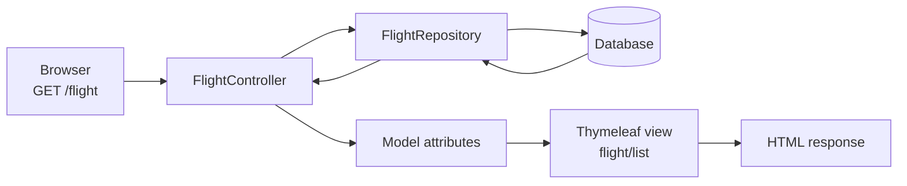

# LAB-11: Database system development (Flights Catering domain)

## Prerequisites

### MVC

The application is organized according to the MVC (Model-View-Controller) architecture. The main idea of MVC is to separate the data of the application, the logic that handles requests, and the presentation layer that renders the response for the user.

- Model represents the application data and the rules associated with that data.
- View is responsible for rendering the HTML page that is returned to the user.
- Controller accepts the HTTP request, invokes the required logic, and decides which view should be returned.

To see how this works in practice, consider the `flight` functionality.

- `Flight` represents the model.
- `FlightController` represents the controller.
- `flight/list` and `flight/create` are views rendered with Thymeleaf.
- `FlightRepository` is used to load and save the data related to `Flight`.

Consider the request `GET /flight`. First, the browser sends the request to the server. Then `FlightController` handles it and calls `FlightRepository` to obtain the list of flights from the database. After that, the controller places the result into the Spring `Model` and returns the `flight/list` view. Finally, Thymeleaf renders the page, and the browser receives the generated HTML response.



You can treat this project as a template for your own project. You can use the same structure and adapt it to your needs.

## 1. How to build a project?

### 1.1. Prerequisites

- Install [IntelliJ IDEA](https://www.jetbrains.com/idea/download/)
  - You can use the Community edition, but the Ultimate edition is recommended. You can use your student license for it.
- Install [Java 21] https://adoptium.net/temurin/releases/
  - Another option: https://sdkman.io/. Sdkman is a tool for managing parallel versions of multiple Software Development Kits on most Unix-based systems. Refer to this page for installation instructions: https://sdkman.io/usage/
- Install [Gradle] (*Optional*) https://gradle.org/install/
  - You can use Sdkman to install Gradle as well. Gradle is a build automation tool that is used to automate the building, testing, publishing, and deployment of software packages.
- Install [MySQL] https://dev.mysql.com/downloads/mysql/
  - or using Docker: `docker run --name mysql -e MYSQL_ROOT_PASSWORD=root MYSQL_DATABASE=<database_name_of_your_choice> -p 3306:3306 -d mysql:lts`

### 1.2. Clone and open the project

```bash
git clone git@github.com:stanislav-pavliuk/flights-db-hw-3.git
```

or you can use the option `Get from VCS` in IntelliJ IDEA.


Open the project in IntelliJ IDEA using the `Open` option.

Now you can build the sources using either `./gradlew build` command or using the `Build` option in IntelliJ IDEA.

### 1.3. Run the project

First of all, you need to create database. Use:

```sql
CREATE DATABASE inflight_catering_service; -- or any other name you want
```

Now, open the `src/main/resources/application.properties` file and change the `spring.datasource.url` property to your database name. For example:

```properties
spring.datasource.url=jdbc:mysql://localhost:3306/inflight_catering_service
spring.datasource.username=<your_username>
spring.datasource.password=<your_password>
```

Then you can run the project using the `./gradlew bootRun` command or using the `Run` or `Debug` option in IntelliJ IDEA.

### 1.4. Verify

Open the following URL in your browser:

```
http://localhost:8080
```

# Database Schema


# Dependencies

You can evaluate all the dependencies in the `build.gradle` file:

```groovy
// Spring Boot starters for interaction with the database
implementation 'org.springframework.boot:spring-boot-starter-jdbc'
implementation 'org.springframework.boot:spring-boot-starter-data-jdbc'
runtimeOnly 'com.mysql:mysql-connector-j'

// Database migration tool Liquibase
implementation 'org.liquibase:liquibase-core'

// Spring Boot starters for web application
implementation 'org.springframework.boot:spring-boot-starter-web'
implementation 'org.springframework.boot:spring-boot-starter-thymeleaf'

// Spring Boot starters for development and testing
developmentOnly 'org.springframework.boot:spring-boot-devtools'
testImplementation 'org.springframework.boot:spring-boot-starter-test'
testRuntimeOnly 'org.junit.platform:junit-platform-launcher'

// Other peculiar dependencies. Project Lombok greatly reduces the amount of boilerplate code
compileOnly 'org.projectlombok:lombok:1.18.36'
annotationProcessor 'org.projectlombok:lombok:1.18.36'
implementation 'org.springframework.boot:spring-boot-configuration-processor'
implementation 'org.springframework.boot:spring-boot-starter-actuator'
```

# Useful links

While you may use this project as a reference, you may also want to check out some of the following resources to get a better understanding of the technologies/libraries used there. *Some of the links are already included in [HELP.md](HELP.md).*

Couple of notes before:

*After watching some of these resources you might be tempted to use Spring Data JPA. However, since, the whole point of the course is to study databases, please stick to the Spring Data JDBC. You may choose to use: JdbcClient, JdbcTemplate or @Query annotation to specify your queries. It's still pretty high-level API, but it will force you to interact with your DBMS little bit more.*

*Using Liquibase is optional, however, database migrations are a good practice in industry. You can use it to create your database schema and populate it with some initial data.*

## Videos

* [Spring Boot with Thymeleaf] (https://www.youtube.com/watch?v=KTBWCJPKiqk)
* [Spring Data JDBC] (https://www.youtube.com/playlist?list=PLogZqOaRQiHk0gtuAbp2j31QYqoXBIU5m)
  * [Another one on using JDBC template] (https://www.youtube.com/watch?v=TUOwlaqZ0eo). *Josh Long is a great guy, so follow him if you're interested with the development in Java/Spring*
* [Liquibase with Spring Boot] (https://www.youtube.com/watch?v=cc_QpEA97xE)
  * [Liquibase] (https://www.youtube.com/watch?v=YhicwD489xQ)

It'll should be enough to get you started with the project.

## Docs


Spring-related projects are usually brilliantly documented. You can find the documentation for the Spring Boot framework here: [Spring Boot Documentation] (https://docs.spring.io/spring-boot/docs/current/reference/html/)

* [Spring Boot Reference Documentation] (https://docs.spring.io/spring-boot/docs/current/reference/html/)
* [Spring Data JDBC Reference Documentation] (https://docs.spring.io/spring-data/jdbc/docs/current/reference/html/)
* [Thymeleaf Documentation] (https://www.thymeleaf.org/doc/tutorials/3.1/usingthymeleaf.html)
* [Liquibase Documentation] (https://www.liquibase.org/get-started/quickstart)
* [Lombok Documentation] (https://projectlombok.org/features/all)

You can also check this ([Spring PetClinic] (https://github.com/spring-projects/spring-petclinic)) project as a great reference project for Spring Boot application development.

---

Enjoy coding!
